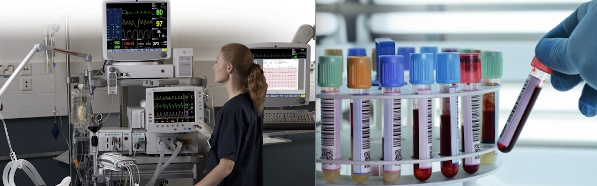
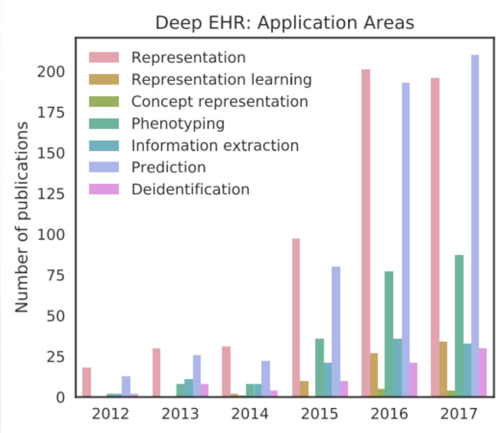
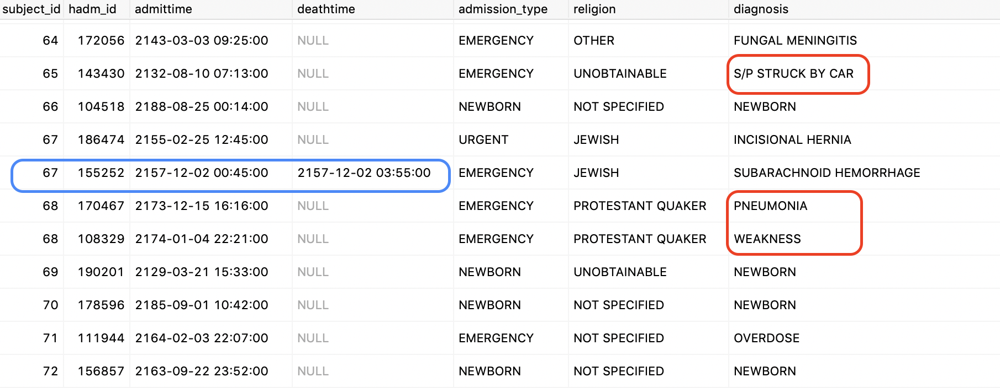
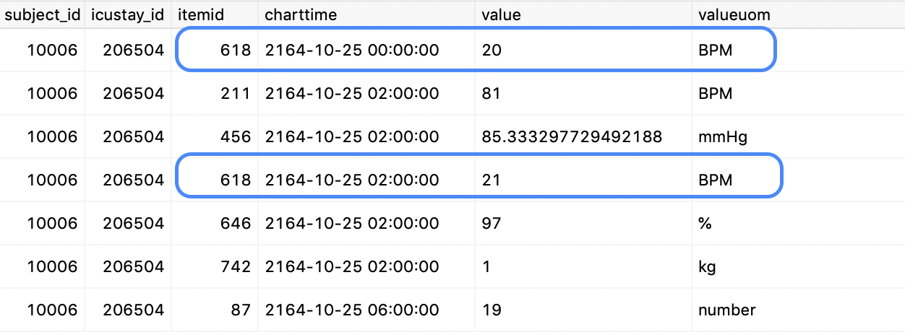

class: middle


```{r setup, include=FALSE}
options(htmltools.dir.version = FALSE)
```

```{r xaringan-themer, include=FALSE}
library(xaringanthemer)
solarized_light(
  code_font_family = "Fira Code",
  code_font_url = "https://cdn.rawgit.com/tonsky/FiraCode/1.204/distr/fira_code.css")

```


# Outline

### EHR data and challenges 

### Feature learning and application in EHR 

### 2 methods for MIMIC III data
#### 1. LSTM autoencoder
#### 2. Tensor decomposition 


---

# Electronic Health Records

Routinely generated patient data by: 
- bed side monitors, clinicians, lab tests 

```{r echo = F, out.width='90%', fig.align='center'}

```

- More specialised (less common): images


- Initially used for billing and administrative purposes: not for research! 


---
class: middle

# Who benefits from EHR research?

#### Patients 
- disease progression prediction / early detection
  - e.g. Heart failure, 
  - in-hospital mortality, 
  - disease stage

#### Medical professionals 
- improve diagnosis
  - image evaluation
- automate routine process
  - risk score 
  
#### Institution: hospitals 
- cost reduction 
- privacy protection 
  


 
---

# Research topics

```{r echo = F, out.width='70%', fig.align='center'}

```


---
# Challenge 1: Avalibility 

```{r echo = F, out.width='70%', fig.align='center'}
knitr::include_graphics('./img/imgChallenge0.png')
```

#### Privacy protection
- no data at all
- or: brutal anonymisation


---
# Solution: MIMIC III data

### ICU data 
Pros: relatively complete

  - demographics, vital sign measurements, lab test results, 
  - procedures, medications, imaging reports
  - notes 
  
Cons: severely ill, multiple diagnosis within one same subject

### MIMIC III - Medical Information Mart for Internsive Care
- Critical care units, Beth Israel Deaconess Medical Center (Boston, US), 2001-2012 
- over 50,000 records for 30,000+ patients 
- De-identification: randomised time stamp 


---
Static data (table **admissions**)
```{r echo = F, out.width='90%', fig.align='center'}

```

Dynamic data (table ** chartevents **)
```{r echo = F, out.width='70%', fig.align='center'}

```


Information scattering around: 26 such tables, possibly large (330 million rows in ** chartevents **)

---
### Connect PostgreSQL Database with R 

```{r echo = T, eval = F}
library(RPostgreSQL)
drv <- dbDriver("PostgreSQL")        # PostgreSQL driver
con <- dbConnect(drv, 
                 dbname = "mimicbig",    # database name
                 host = "localhost", 
                 port = 5432,
                 user = "chizhang", 
                 password = pw)
query <- 'SELECT * FROM admissions WHERE subject_id = 10006'
record <- dbGetQuery(con, statement = query)
```

#### Comments:

Know what information you need;

Partition large tables for speed.

---
# Challenge 2: data quality

Usability 
- various systems even within one hospital


Lack of 'golden standard' diagnosis

Missingness
- at random?
- not at random? 


---
# Challenge 3: Multi-modality

Numeric measurements

Categorical information: diagnosis code, ethnicity

Free text

Time stamp 

Images and signals: ECG waveforms

Genomic information 


---
# Challenge 4: Irregularity (length)

Unequal length of measurements 

From a few hours to a few thousand hours 

(graph of distribution )

---
# Challenge 5: Irregularity (frequency)

Various sampling frequency 
- High: Electrocardiogram (ECG) (suffers from artifact corruption)
- Medium: vitals, input, output
- Low: lab tests, clinical notes (done by order)
- Static: demographics, diagnosis

(graph (heatmap? missing values?))


---
# Feature / Representation learning 

Feature: a characteristic that helps with the modeling.

Feature / Representation learning: techniques that make it easier to extract information when building predictive models 

### Motivations
- Feature **Engineering** vs **Learning** 

- Dimension reduction (*PCA*)
  - visualization (clustering, e.g. *K-means*)
  - memory saving (in the early days, e.g. *symbolic aggregation*)

- Precictive performance (? *Lasso*, *Autoencoder, RNN*)
  
- Capture pattern from multiple modes such as time (*tensor*)


---
### Example 1: Autoencoder 

Non probablistic, direct encoding: parametric map from input to representation

**Encoder**: $h = f_\theta (x) = s_f (b + Wx)$ 

**Decoder**: $g_\theta (h) = s_g (d + Wx)$

Minimise **reconstruction** error: $L(x, g_\theta (f_\theta(x)))$

```{r echo = F, out.width='80%', fig.align='center'}
knitr::include_graphics('./img/imgAE.png')
```


---
### Example 2: Tensor decomposition 

Tensor: multi-dimensional array 
- order 0: scalar
- order 1: vector 
- order 2: matrix
- order 3: cube 

(explain what is decomp and how it can be used as representation)


---
### Tensor decomp: application in computational phenotyping 


---
## Representation: Evaluation

What is a good representation? 

cite (Bengio 2014)

Simple: 

- Representation themselves
  - understand structure of data, such as visualisation 
  
- Prediction / classification performances


---
# Back to MIMIC III data

Recall data characteristics: 
- Temporal
- Unevenly sampled, unequal length

Objective: **predict in-hospital mortality**

Pre-requisite: patient representation 

Options

1. LSTM AE (use Suresh 2018 paper for example)

2. Our attempt: similarity tensor decomposition 

<br>
.full-width[.content-box-yellow[Backstory: we were inspired by Suresh 2018 study, hence the objective and choice of inputs]]

---
## Long short term memory Autoencoder (LSTM AE)
(insert pic from suresh 2018 paper)

Key idea: 
- LSTM (complicated, once use Keras it's impossible to understand)
- has some phenotyping ideas (link to a few other AE phenotyping paper)

Choice of inputs: 


#### Implementation: 

keras + Gaussian mixture model (scikit learn)

#### Performance


---
## Similarity tensor decomposition  
(! testing stage! )


