class: middle


```{r xaringan-themer, include=FALSE}
library(xaringanthemer)
solarized_light(
  code_font_family = "Fira Code",
  code_font_url = "https://cdn.rawgit.com/tonsky/FiraCode/1.204/distr/fira_code.css")

```


# Outline

### EHR data and challenges 

### Feature learning and application in EHR 

### 2 methods for MIMIC III data
#### 1. LSTM autoencoder
#### 2. Tensor decomposition 


---

# Electronic Health Records

Initially used for billing and administrative purposes

Routinely generated patient data from: 
- bed side monitors, lab tests 

```{r echo = F, out.width='90%', fig.align='center'}
knitr::include_graphics('./img/img2.png')
```

- More specialised: images such as waveforms

- Administration: demographics

---
#### Clinical notes 

```{r echo = F, out.width='100%', fig.align='center'}
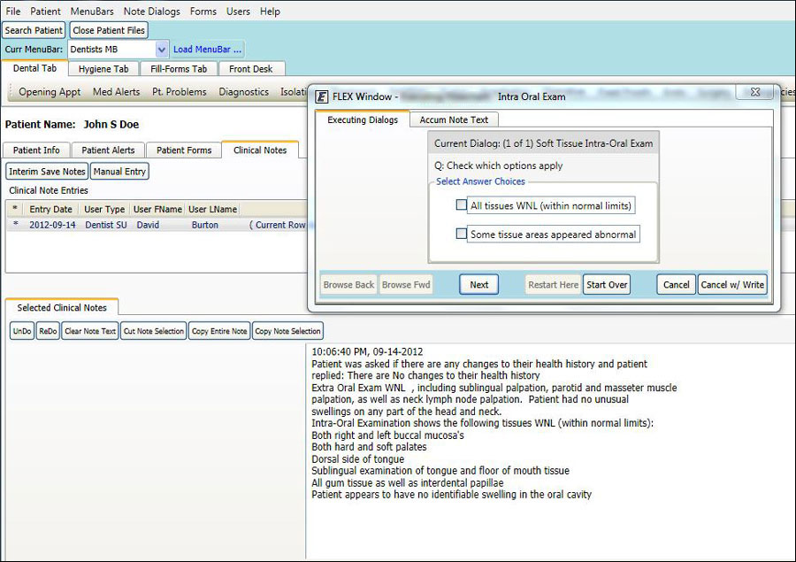
```

---
class: middle

# Who benefits from EHR research?
#### Patients 
- disease progression prediction / early detection
  - e.g. heart failure, <span style = 'color:maroon'>(Choi 2016)</span>
  - in-hospital mortality, <span style = 'color:maroon'>(Suresh 2018)</span>
  - Parkinson's disease stage <span style = 'color:maroon'>(Che 2017)</span>

#### Medical professionals 
- automate diagnosis
  - image evaluation: detect hip fracture from X-ray <span style = 'color:maroon'>(Gale 2017)</span>
- automate routine process
  - summarize content from medical records <span style = 'color:maroon'>(McCoy 2018)</span> 
  
#### Institution: hospitals 
- cost reduction 
- privacy protection 
  


 
---

## Research topics

Number of Google Scholar publications relating to **deep EHR** until 2017 <span style = 'color:maroon'>(Shickel 2018 Survey)</span>

```{r echo = F, out.width='70%', fig.align='center'}
knitr::include_graphics('./img/imgTopics.png')
```


---
# Challenge 1: Avalability 

```{r echo = F, out.width='70%', fig.align='center'}
knitr::include_graphics('./img/imgChallenge0.png')
```

--
#### Privacy protection
- no data at all

- or: 'brutal' anonymisation


---
# Lifesaver: MIMIC III data

### ICU data 
Pros: relatively complete

  - demographics, vital sign measurements, lab test results, 
  - procedures, medications, imaging reports
  - notes 
  
Cons: severely ill, multiple diagnosis within one same subject

--
### MIMIC III - Medical Information Mart for Intensive Care
- Critical care units, Beth Israel Deaconess Medical Center (Boston, US), 2001-2012 
- over 50,000 records for 30,000+ patients 
- De-identification: randomised time stamp 


---
Static data (table **admissions**)
```{r echo = F, out.width='90%', fig.align='center'}
knitr::include_graphics('./img/imgMimic1.png')
```

--
Dynamic data (table ** chartevents **)
```{r echo = F, out.width='70%', fig.align='center'}
knitr::include_graphics('./img/imgMimic2.png')
```

--
Information scattering around: 26 such tables, possibly large (330 million rows in ** chartevents **)

---
### Connect PostgreSQL Database with R 

```{r echo = T, eval = F}
library(RPostgreSQL)
drv <- dbDriver("PostgreSQL")        # PostgreSQL driver
con <- dbConnect(drv, 
                 dbname = "mimicbig",    # database name
                 host = "localhost", 
                 port = 5432,
                 user = "chizhang", 
                 password = pw)
query <- 'SELECT * FROM admissions WHERE subject_id = 10006'
record <- dbGetQuery(con, statement = query)
```

-- 
#### Comments:

Know what information you need;

Partition large tables for speed.

---
# Challenge 2: data quality

**Digital artifact corruption**

- Undesired alteration in data due to technical reasons
- e.g. accidental removal of sensor

--

**Inconsistency and duplications**
- Various database systems within one hospital
- Example 1: Carevue and Metavision within MIMIC III, 2 sets of item IDs
- Example 2: measurement recorded by different staff into different systems


**Missingness**
- at random?
- not at random? 


**lack of labels**
Makes predictive models hard

---
# Challenge 3: Multi-modality

Numeric measurements

Categorical information: diagnosis code, ethnicity

Free text

Time stamp 

Images and signals: ECG waveforms

Genomic information 


---
# Challenge 4: Irregularity (length)

Unequal length of measurements: from a few hours to a few thousand hours 

```{r}
los <- read.csv('~/Documents/Data/los.csv')
loshours <- los*24
summary(loshours$los)
```


```{r echo = F, out.width='95%', fig.align='center'}
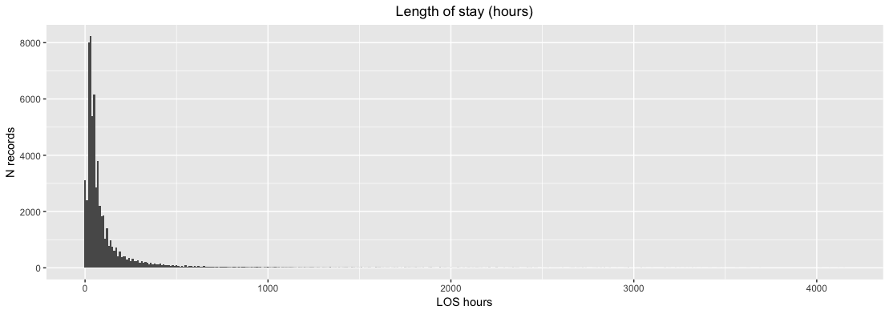
```


---
# Challenge 5: Irregularity (frequency)

Various sampling frequency 
- High: Electrocardiogram (ECG) 
- Medium: vitals, input (e.g. medication), output (e.g. urination)
- Low: lab tests, clinical notes (done by order)
- Static: demographics, diagnosis

Example: patient in MICU for 124 hours, selected **vital** and **lab test results**

```{r echo = F, out.width='95%', fig.align='center'}
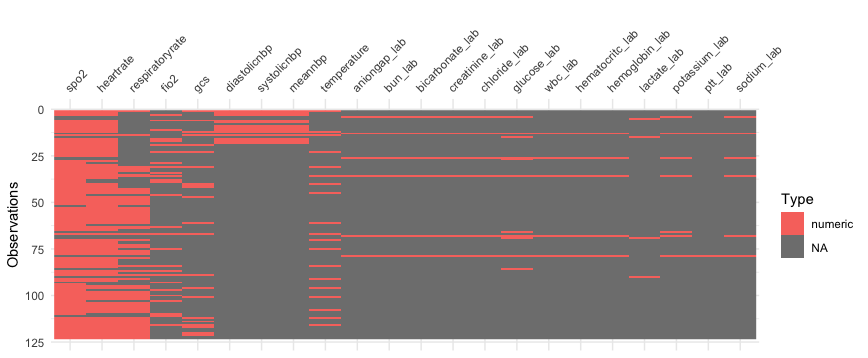
```


---
### To sum up, challenges of EHR data


- data usability 
- lack of labels
- multi-modality
- unequal length
- unequal frequency 
- ...


```{r echo = F, out.width='70%', fig.align='center'}

```


---
# Feature / Representation learning 

Feature: a characteristic that helps with the modeling.

**Feature / Representation learning**: techniques that make it easier to extract information, eitehr to understand the data structure, or when building predictive models 

--

### Motivations
- Feature **Engineering** vs **Learning** 

- Dimension reduction (*PCA*)
  - visualization (clustering, e.g. *K-means*)
  - memory saving (in the early days, e.g. *symbolic aggregation*)

- Precictive performance (*Lasso*, *Autoencoder, RNN*)
  
- Capture pattern from multiple modes such as time (*tensor*)


---
### Example 1: Autoencoder 

Non probablistic, direct encoding: parametric map from input to representation
```{r echo = F, out.width='70%', fig.align='center'}
knitr::include_graphics('./img/imgAE.png')
```

- **Encoder**: $h = f_\theta (x) = s_f (b + Wx)$ 
- **Decoder**: $g_\theta (h) = s_g (d + Wx)$
  - Activation functions: linear, sigmoid, hyperbolic tangent 
  
  
- Minimise **reconstruction** error: $L(x, g_\theta (f_\theta(x)))$
  - Squared loss, binary cross-entropy loss

--

- In some cases the 'bottle-neck' hidden layer is used as representation. 
- Variations: Denoising AE, Sparse AE, Variational AE etc 

---
### Example 2: Tensor decomposition 

Tensor: multi-dimensional array 
- order 0: scalar
- order 1: vector 
- order 2: matrix
- order 3: cube 


### CP: CANDECOMP/PARAFAC 
Express a tensor into a sum of finite number of rank-one tensors (i.e. can be written by the outer product of $N$ vectors)


```{r echo = F, out.width='70%', fig.align='center'}
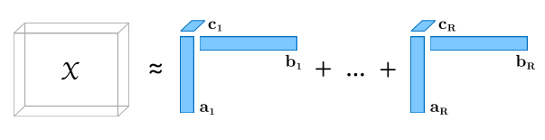
```

Factor matrices: combination of vectors $A = [\textbf{a}_1 \quad \textbf{a}_2... \textbf{a}_R ]$

---

### Tucker decomposition
(Higher order SVD, N-mode PCA): a tensor into a core tensor multiplied by matrix along the sides; factor matrices are usually orthogonal

```{r echo = F, out.width='50%', fig.align='center'}
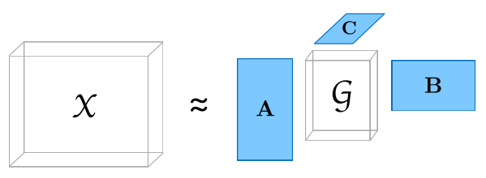
```

--
### PARAFAC2

```{r echo = F, out.width='70%', fig.align='center'}
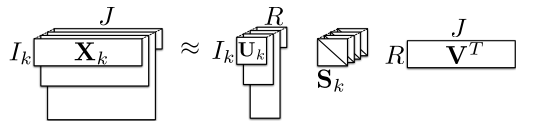
```

Applications: phenotyping with varying measurements

---

### Application in computational phenotyping 

**Phenotyping**: identify patients with certain characteristics of interest. As simple as Type 2 Diabetes

Example: <span style = 'color:maroon'>(Ho 2014)</span>

```{r echo = F, out.width='60%', fig.align='center'}
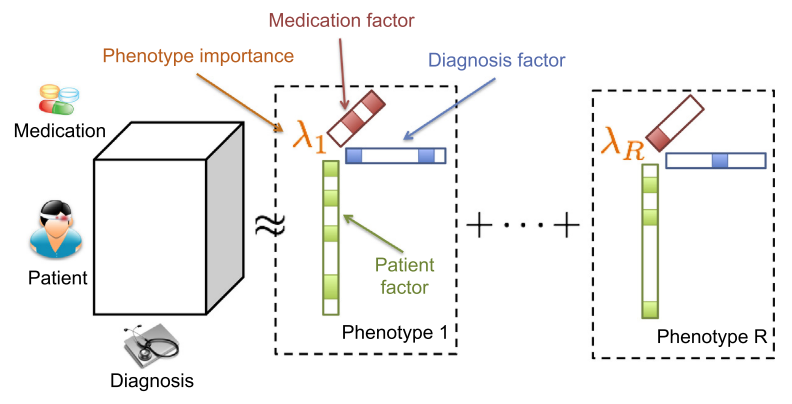
```

Phenotype interpretation: 
```{r echo = F, out.width='40%', fig.align='center'}
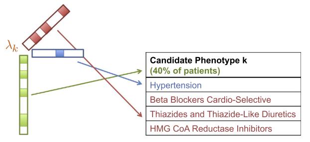
```


---
## Representation: Evaluation

What is a good representation? 

<span style = 'color:maroon'>(Bengio 2014)</span> Sparsity, temporal and spatial coherent, smoothness, ... 

--
#### More practical standards:  

- Representation themselves
  - no standard metric, depend on the problems 
  - custom metrics (e.g. 'Medical concept similarity measure'<span style = 'color:maroon'>(Choi 2016)</span>)
  - visualization (e.g. heatmap)
  
- Classification performances

  - AUC, accuracy, precision, recall, ... 


---
## Current project (using MIMIC data)

#### Objective: 
Investigate patient representation options, better representation means better accuracy in prediction of in-hospital mortality
<br>
.full-width[.content-box-yellow[Backstory: we were inspired by Suresh 2018 study, hence the objective and choice of inputs]]


Options for representation

1. LSTM AE (Suresh 2018 paper)

2. Our experiment: feature similarity tensor decomposition 


---
## Long short term memory Autoencoder (LSTM AE)

Suresh, Gong, Guttag 2018 Paper @ KDD: 

**Learning Tasks for Multi-task Learning: Heterogenous Patient Population in ICU**

Key idea: 
- Input: 29 variables (static and dynamic)
- first 24 hours dynamic records
- use LSTM AE to embed patient data from 3 modes: time, features, patient
- predictive task: mortality at hour 36

```{r echo = F, out.width='100%', fig.align='center'}
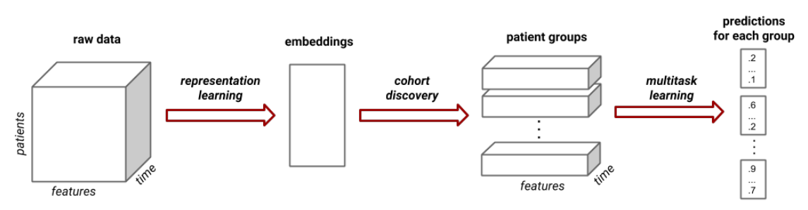
```


---
Choice of inputs: 

```{r echo = F, out.width='80%', fig.align='center'}
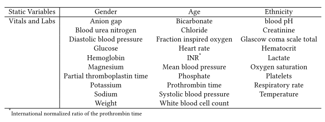
```


#### Implementation: 

- Keras 
- Input dimension: `n_samples * n_timesteps * n_features`
- Embedded: `n_samples * n_latent` 
    - (100, the elbow in reconstruction error curve on validation set)
- Clusters: Gaussian mixture model, 3 clusters(for best performance)
- Prediction: 

#### Performance
AUC > 0.8 across different setups 

---
## Similarity tensor decomposition  
(! testing stage! )

Key ideas
- utilise whole series, not only first 24 hours

- deal with irregularity and missingness: **use feature similarity instead of individual series**

  - natural cluster: better performance in personalized predictive tasks 
  
- Tensor decomposition on feature-similarity tensor

- Representation: factor matrix 

---
## Feature similarity

Trying out 2 things: 

**SAX** (Symbolic Aggregate Approximation): raw time series into discrete symbols 

  - Dimension reduction 


**Dynamic Time Warping** 

  - similarity measure for time series data
  - computes the most optimal warping alignment path - unequal length!
  - applications in TS clusterng / classification


```{r echo = F, out.width='40%', fig.align='center'}
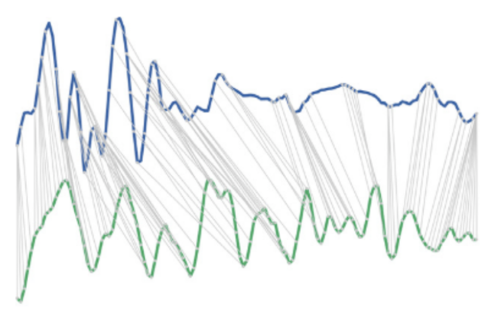
```


